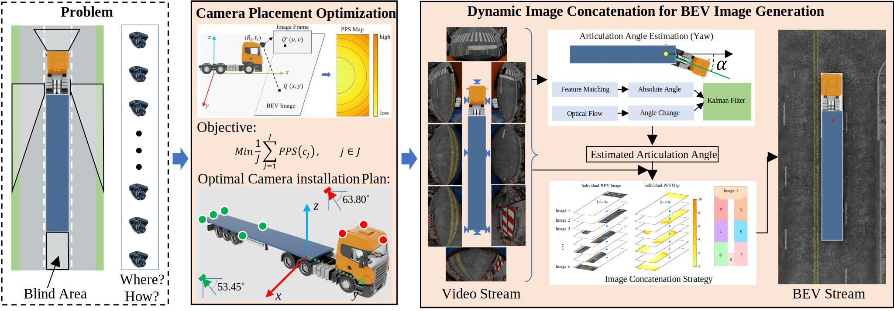

# Multi-Camera Surround View Monitoring (SVM) System for Semi-Trailer Trucks

A research project implementing a **multi-camera SVM framework** for semi-trailer trucks to support safe maneuvering of oversized goods in constrained urban environments.

This repository complements the paper:  
> *Title: Multi-camera Surround View Monitoring System for Oversized Semi-Trailer Trucks: Camera Placement Optimization and Dynamic Image Concatenation*  
> *(Currently under review)*

---

## 🚚 Project Overview
This project focuses on developing a systematic and practical framework for SVM systems on semi-trailer trucks, aiming to generate high-fidelity Bird’s-Eye-View (BEV) images. The goal is to enhance situational awareness and support safe operations, such as transporting Modular Integrated Construction (MiC) modules in urban environments.

The framework includes:
- **Camera Placement Optimization (CPO):** Determines the optimal number and positions of fisheye cameras to maximize BEV image fidelity while minimizing hardware cost.
- **Spatial–Temporal Fusion Articulation-Angle Estimation (AAE):** A camera-only method that robustly estimates the articulation angle between the tractor and trailer, even under occlusions or disturbances.
- **Dynamic Image Concatenation (DIC):** Produces seamless BEV images by selecting the optimal image source for each pixel rather than relying on traditional seam-based stitching.

*Figure: Overall framework of the proposed multi-camera SVM system for semi-trailer trucks.*

---

## ✨ Key Features
- 📷 **Optimized camera placement** for high coverage and clear BEV images.
- 🔗 **Robust articulation angle estimation** using spatial–temporal fusion and Kalman filtering.
- 🖼️ **High-fidelity BEV image generation** with reduced distortion for near-field 3D objects.
- ⚙️ Designed for **scalability** to various semi-trailer configurations.

---

## 🖥️ Simulation Platform
- **Operating System:** Ubuntu 20.04.6 LTS
- **CPU:** Intel® Core™ i9‑14900K ×32
- **GPU:** NVIDIA RTX 4090D
- **Memory:** 94 GB
- **Simulation Frame Rate:** 10 FPS (due to rendering constraints of the simulation environment)

---

## 📊 Simulation Results
A demonstration of the simulation results can be viewed in the video below:

▶️ [**Watch on YouTube**](https://youtu.be/gVBraPmdiUI) 

The video highlights:
- Accuracy of articulation-angle estimation
- Seamless and distortion-minimized BEV images
- Real-time performance in simulated driving scenarios

---

## 📈 Future Work
- Develop **fiducial‑marker‑based calibration** for real-world camera extrinsics.
- Integrate **roll and pitch modeling** to improve BEV accuracy on uneven terrain.
- Incorporate **height and depth estimation** (e.g., via stereo vision or LiDAR fusion).
- Extend functionalities for **3D object detection, obstacle warnings, and trajectory prediction**.

---

## 📜 Citation
If you use this project in your research, please cite the paper (link will be provided after publication).

---

> ⚠️ **Note:** This repository currently focuses on the **simulation-based framework**. Real-world implementation with hardware calibration and on-road testing is in progress and will be released in future updates.
